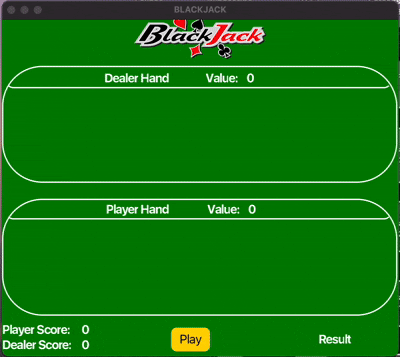

Blackjack Game

Overview  
This project is a Blackjack game built using JavaFX. It simulates a real-world casino-style Blackjack experience, where a player competes against a dealer. The game follows standard Blackjack rules, including hitting, standing, and busting.

Features 
Interactive GUI: Built with JavaFX to provide a user-friendly interface. 
Game Mechanics: Implements standard Blackjack rules, including dealing cards, scoring, and dealer AI. 
Player Actions: Players can hit, stand, and automatically win with Blackjack. 
Dealer AI: The dealer follows conventional casino rules (must hit below 17, stand on 17 or higher). 
Win/Loss Conditions: Includes logic for winning, losing, and drawing. 
Card Deck Handling: Uses a shuffled deck for randomized outcomes. 

Technologies Used 
Java: Core programming language 
JavaFX: For graphical user interface (GUI) development 
OOP Principles: Encapsulation, inheritance, and polymorphism 

How to Run 
Ensure you have Java 8 or higher installed. 
Install JavaFX if required (depending on your setup). 
Clone this repository: git clone <repository-url> 
Navigate to the project folder: cd blackjack-game 

Compile and run the application: 
javac BlackjackGame.java
java BlackjackGame

How to Play 
Start the game, and you will be dealt two cards. 
The dealer also gets two cards (one face-up, one face-down). 
Choose to Hit (get another card) or Stand (keep your current total). 
The dealer reveals their second card and plays according to the rules. 
The winner is determined based on the closest total to 21 without exceeding it. 
The game announces the winner and provides an option to restart. 

Future Improvements 
Implement betting mechanics to enhance realism. 
Add split and double down options for advanced gameplay. 
Improve animations and sound effects for a more immersive experience. 

